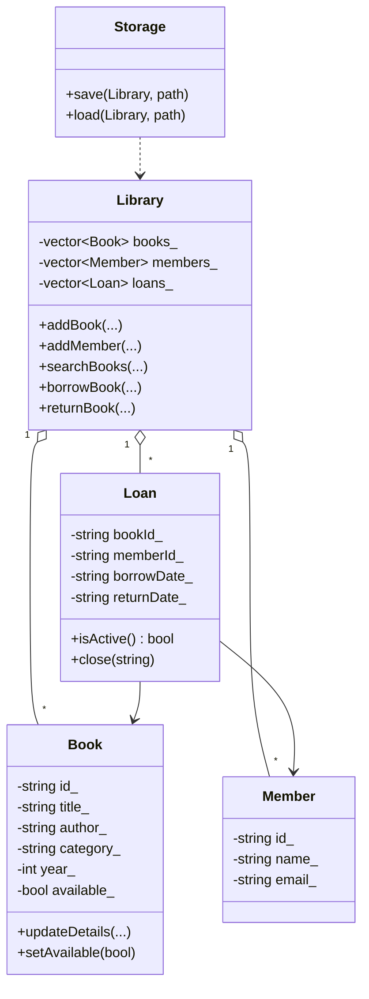

# Class diagram

```mermaid
classDiagram
    class Book {
      -string id_
      -string title_
      -string author_
      -string category_
      -int year_
      -bool available_
      +updateDetails(...)
      +setAvailable(bool)
    }
    class Member {
      -string id_
      -string name_
      -string email_
    }
    class Loan {
      -string bookId_
      -string memberId_
      -string borrowDate_
      -string returnDate_
      +isActive() bool
      +close(string)
    }
    class Library {
      -vector~Book~ books_
      -vector~Member~ members_
      -vector~Loan~ loans_
      +addBook(...)
      +addMember(...)
      +searchBooks(...)
      +borrowBook(...)
      +returnBook(...)
    }
    class Storage {
      +save(Library, path)
      +load(Library, path)
    }
    Library "1" o-- "*" Book
    Library "1" o-- "*" Member
    Library "1" o-- "*" Loan
    Loan --> Book
    Loan --> Member
    Storage ..> Library
```
